<!-- Generated by Suite Builder. EDIT RULES: do not edit this file; regenerating replaces all of it. Your own notes on the site go in ai/AI-README.md. -->
# The site's shape

https://the-internet.herokuapp.com as the crawl saw it: each box a kind of page (its class and address), each arrow a link
between them. A solid arrow is followed by a navigation test; a dotted one is not, and why is below.
Navigation tests follow 52 of 54 transitions (coverage: transitions);
every kind of page is opened by its smoke test, 49 of 49.

```mermaid
flowchart LR
  n0["HomePage<br/>/"]
  n1["TinymcePage<br/>/tinymce"]
  n2["FramesPage<br/>/frames"]
  n3["DropdownPage<br/>/dropdown"]
  n4["NotificationMessageRenderedPage<br/>/notification_message_rendered"]
  n5["ChallengingDomPage<br/>/challenging_dom"]
  n6["JavascriptAlertsPage<br/>/javascript_alerts"]
  n7["ExitIntentPage<br/>/exit_intent"]
  n8["JqueryuiMenuPage<br/>/jqueryui/menu"]
  n9["TablesPage<br/>/tables"]
  n10["InfiniteScrollPage<br/>/infinite_scroll"]
  n11["InfiniteScrollDetailPage<br/>/infinite_scroll/*"]
  n12["DynamicLoadingPage<br/>/dynamic_loading"]
  n13["DynamicLoadingDetailPage<br/>/dynamic_loading/*"]
  n14["ShadowdomPage<br/>/shadowdom"]
  n15["DisappearingElementsPage<br/>/disappearing_elements"]
  n16["RedirectorPage<br/>/redirector"]
  n17["GeolocationPage<br/>/geolocation"]
  n18["AddRemoveElementsPage<br/>/add_remove_elements/"]
  n19["JavascriptErrorPage<br/>/javascript_error"]
  n20["EntryAdPage<br/>/entry_ad"]
  n21["StatusCodesPage<br/>/status_codes"]
  n22["StatusCodesDetailPage<br/>/status_codes/*"]
  n23["NestedFramesPage<br/>/nested_frames"]
  n24["ForgotPasswordPage<br/>/forgot_password"]
  n25["CheckboxesPage<br/>/checkboxes"]
  n26["LargePage<br/>/large"]
  n27["UploadPage<br/>/upload"]
  n28["IframePage<br/>/iframe"]
  n29["DynamicContentPage<br/>/dynamic_content"]
  n30["ShiftingContentPage<br/>/shifting_content"]
  n31["ShiftingContentDetailPage<br/>/shifting_content/*"]
  n32["ShiftingContentMenuPage<br/>/shifting_content/menu"]
  n33["HoversPage<br/>/hovers"]
  n34["AbtestPage<br/>/abtest"]
  n35["KeyPressesPage<br/>/key_presses"]
  n36["DynamicControlsPage<br/>/dynamic_controls"]
  n37["TyposPage<br/>/typos"]
  n38["ContextMenuPage<br/>/context_menu"]
  n39["HorizontalSliderPage<br/>/horizontal_slider"]
  n40["BrokenImagesPage<br/>/broken_images"]
  n41["WindowsPage<br/>/windows"]
  n42["WindowsNewPage<br/>/windows/new"]
  n43["FloatingMenuPage<br/>/floating_menu"]
  n44["JqueryuiPage<br/>/jqueryui"]
  n45["DownloadPage<br/>/download"]
  n46["SlowPage<br/>/slow"]
  n47["InputsPage<br/>/inputs"]
  n48["DragAndDropPage<br/>/drag_and_drop"]
  n0 --> n1
  n0 --> n2
  n0 --> n3
  n0 --> n4
  n0 --> n5
  n0 --> n6
  n0 --> n7
  n0 --> n8
  n0 --> n9
  n0 --> n10
  n0 --> n12
  n0 --> n14
  n0 --> n15
  n0 --> n16
  n0 --> n17
  n0 --> n18
  n0 --> n19
  n0 --> n20
  n0 --> n21
  n0 --> n23
  n0 --> n24
  n0 --> n25
  n0 --> n26
  n0 --> n27
  n0 --> n29
  n0 --> n30
  n0 --> n33
  n0 --> n34
  n0 --> n35
  n0 --> n36
  n0 --> n37
  n0 --> n38
  n0 --> n39
  n0 --> n40
  n0 --> n41
  n0 --> n43
  n0 --> n45
  n0 --> n46
  n0 --> n47
  n0 --> n48
  n2 --> n23
  n2 --> n28
  n8 -.-> n44
  n10 -.-> n11
  n11 --> n11
  n12 --> n13
  n15 --> n0
  n21 --> n22
  n22 --> n21
  n30 --> n31
  n30 --> n32
  n32 --> n0
  n41 --> n42
  n44 --> n8
```

## Not followed

- JqueryuiMenuPage to JqueryuiPage: hidden when the page loads (a closed menu, a carousel's other slide)
- InfiniteScrollPage to InfiniteScrollDetailPage: hidden when the page loads (a closed menu, a carousel's other slide)
